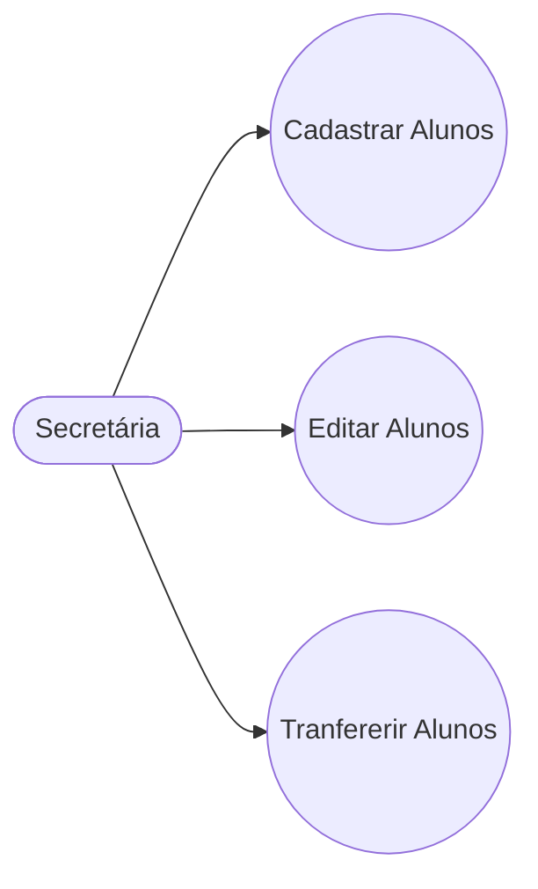
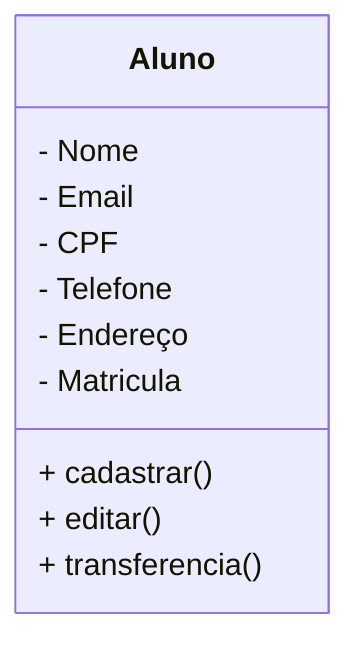

# Projeto Universidade 

Modelagem em Orientação à objetos 
das Entidades Alunos, Cursos e 
Turmas.

## Caso de Uso 

## Diagrama de Classes

## Dependências
- **VS COD**: IDE(Interface de Desenvolvimento)
- **Mermaid**: Linguagem para confecção de diagramas  em documentos MD (Mark Down)
- **Material Icon Theme**: Tema para colorir as pastas
- **Git Lens**: Interface gráfica  pra o versionamento .git  integrada ao VSCode.
